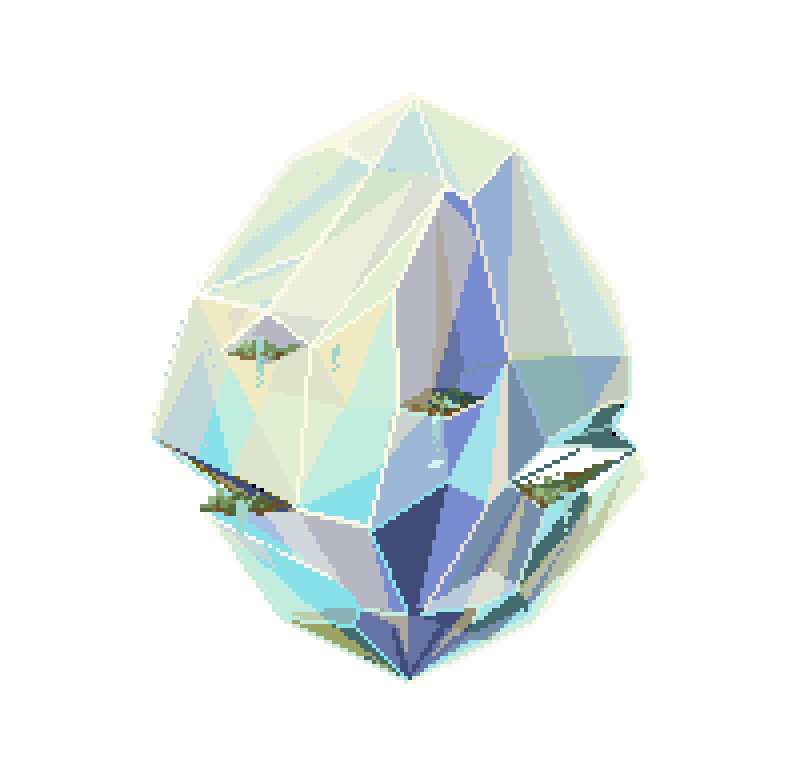

# Prismaristic 

<!-- PROJECT LOGO -->
 

    
  </a>

  <h3 align="center">Prismaristic</h3>
  

     A gamification System to help organize your life!
     
    <a href="https://github.com/M4rvita/Prismaristic/tree/main"><strong>Explore the docs »</strong></a>
     
     
    <a href="https://github.com/M4rvita/Prismaristic/tree/main">View Demo</a>
    .
    <a href="https://github.com/M4rvita/Prismaristic/tree/issues">Report Bug</a>

<!-- ABOUT THE PROJECT -->
## About The Project

(<a href="#readme-top">back to top</a>)

Com a rotina cansativa, estressante e corriqueira do dia a dia, não seria interessante tornar sua vida em algo mais animado, dinâmico e eficiente? Com o Prismaristc, isso é possível! Suas tarefas domésticas, trabalho, estudos, lazer e muito mais totalmente integrados em um sistema de RPG.

### Built With

(<a href="#readme-top">back to top</a>)

Tecnologias que serão utilizadas:
-HTML
-CSS
-JavaScript
-DBs

<!-- MARKDOWN LINKS & IMAGES -->
[issues-shield]: https://img.shields.io/github/issues/othneildrew/Best-README-Template.svg?style=for-the-badge
[issues-url]: https://github.com/M4rvita/Prismaristic/issues
